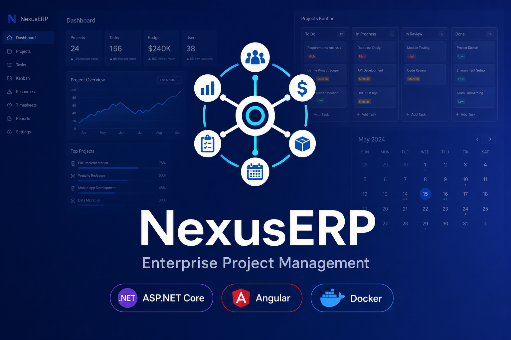

# NexusERP — Enterprise Project Management System

Full-stack enterprise PMS built with **ASP.NET Core 9** and **Angular 20**. Manage projects, tasks, meetings, users, and reports from a responsive web app with real-time notifications and an AI assistant.



## Highlights

| Area | Capabilities |
|------|----------------|
| **Project management** | Projects, tasks, Kanban boards, task calendar |
| **Meetings** | Schedule, edit, cancel meetings with attendees and project links |
| **AI assistant** | Floating chat widget — query data, create tasks, get dashboard stats |
| **Reports** | Summary cards, charts, paginated project overview, Excel export |
| **Security** | JWT + refresh tokens, role-based permissions, audit trail |
| **Real-time** | SignalR notifications with unread badge |
| **UX** | Dark/light theme, mobile-responsive lists, custom confirmation modals |

## Architecture

```
NexusERP/
├── backend/                    # ASP.NET Core Clean Architecture
│   ├── src/
│   │   ├── NexusERP.Domain/           # Entities, enums, domain interfaces
│   │   ├── NexusERP.Application/      # CQRS (MediatR), DTOs, validators, chat tools
│   │   ├── NexusERP.Infrastructure/     # EF Core, Identity, Redis, SignalR, AI chat
│   │   └── NexusERP.API/              # Web API, middleware, Swagger
│   └── tests/
│       └── NexusERP.Tests/            # xUnit tests
├── frontend/
│   └── nexus-erp-web/          # Angular 20 standalone SPA
└── docs/                       # Architecture & feature documentation
```

### Backend layers

| Layer | Responsibility |
|-------|----------------|
| **Domain** | Entities, value objects, repository interfaces, domain events |
| **Application** | Commands/queries (CQRS), DTOs, AutoMapper, FluentValidation, chat tool executor |
| **Infrastructure** | EF Core, ASP.NET Identity, JWT, Redis, SignalR, file storage, `AgenticChatService` |
| **API** | Controllers, middleware, Swagger, health checks |

### Frontend structure

| Folder | Responsibility |
|--------|----------------|
| **core** | Auth, interceptors, guards, layout shell, chat widget, SignalR |
| **shared** | Reusable components (pagination, confirm dialog), pipes, export utilities |
| **features** | Lazy-loaded areas: dashboard, projects, tasks, kanban, calendar, meetings, etc. |

See [docs/ARCHITECTURE.md](docs/ARCHITECTURE.md) for design patterns and API overview.  
See [docs/FEATURES.md](docs/FEATURES.md) for a complete feature list.

## Prerequisites

- [.NET 9 SDK](https://dotnet.microsoft.com/download)
- [Node.js 22+](https://nodejs.org/)
- [Angular CLI 20](https://angular.dev/) — `npm install -g @angular/cli@20`
- [Docker Desktop](https://www.docker.com/) (recommended for SQL Server + Redis + API)

## Quick start

### Option A — Docker (recommended)

```bash
# Start SQL Server, Redis, and API
docker compose up -d sqlserver redis api

# Frontend (separate terminal)
cd frontend/nexus-erp-web
npm install
npm start
```

| Service | URL |
|---------|-----|
| Web app | http://localhost:4200 |
| API | http://localhost:5000 |
| Swagger | http://localhost:5000/swagger |

To run the full stack including the production-built web container:

```bash
docker compose up -d
```

Web container: http://localhost:4200 (nginx serving Angular build)

### Option B — Local development

```bash
# 1. Infrastructure
docker compose up -d sqlserver redis

# 2. Backend
cd backend
dotnet restore
dotnet ef database update --project src/NexusERP.Infrastructure --startup-project src/NexusERP.API
dotnet run --project src/NexusERP.API

# 3. Frontend
cd frontend/nexus-erp-web
npm install
npm start
```

API (local Kestrel): `https://localhost:5001` | Swagger: `https://localhost:5001/swagger`  
Update `frontend/nexus-erp-web/src/environments/environment.ts` if your API port differs.

### Default admin

| Field | Value |
|-------|-------|
| Email | `admin@nexuserp.com` |
| Password | `Admin@123` |

On first API start, the database is seeded with sample users, **45+ projects**, **140+ tasks**, meetings, notifications, and audit logs.

## Modules

| Module | Route | Permission |
|--------|-------|------------|
| Dashboard | `/dashboard` | Authenticated |
| Projects | `/projects` | `projects.view` |
| Tasks | `/tasks` | `tasks.view` |
| Kanban | `/kanban/:projectId` | `tasks.view` |
| Calendar | `/calendar` | `tasks.view` |
| Meetings | `/meetings` | `meetings.view` |
| Users | `/users` | `users.view` |
| Roles | `/roles` | `roles.view` |
| Notifications | `/notifications` | Authenticated |
| Reports | `/reports` | `reports.view` |
| Audit Logs | `/audit-logs` | `audit.view` |
| Settings | `/settings` | `settings.manage` |

**Global UI:** AI chat widget (FAB, bottom-right), theme toggle, notification bell with unread count.

## AI assistant (optional)

The chat widget works out of the box with a **built-in rule-based agent** (no API key required). For OpenAI-powered responses, set an API key:

**Docker** — in `docker-compose.yml`:

```yaml
Ai__OpenAi__ApiKey: "sk-your-key"
Ai__OpenAi__Model: "gpt-4o-mini"
```

**Local** — in `backend/src/NexusERP.API/appsettings.json`:

```json
"Ai": {
  "OpenAi": {
    "ApiKey": "sk-your-key",
    "Model": "gpt-4o-mini"
  }
}
```

Capabilities: query projects/tasks/meetings, dashboard stats, create tasks (with project picker). See [docs/CHATBOT.md](docs/CHATBOT.md).

## Configuration

| Setting | Location | Notes |
|---------|----------|-------|
| API URL | `frontend/.../environments/environment.ts` | Default `http://localhost:5000/api` |
| JWT / DB | `appsettings.json` or Docker env vars | Use secrets in production |
| Page size, theme, confirmations | Settings page in app | Stored in browser `localStorage` |
| CORS | `appsettings.json` → `Cors:Origins` | Default `http://localhost:4200` |

## Testing

```bash
# Backend
cd backend && dotnet test

# Frontend
cd frontend/nexus-erp-web && npm test
```

## Documentation

| Document | Description |
|----------|-------------|
| [ARCHITECTURE.md](docs/ARCHITECTURE.md) | Clean Architecture, patterns, API routes, permissions |
| [FEATURES.md](docs/FEATURES.md) | Full feature catalog and UI behavior |
| [CHATBOT.md](docs/CHATBOT.md) | AI assistant setup, tools, and example prompts |

## Tech stack

**Backend:** ASP.NET Core 9, EF Core, MediatR, FluentValidation, AutoMapper, ASP.NET Identity, JWT, SignalR, Redis, Serilog, xUnit  

**Frontend:** Angular 20, Angular Material, RxJS, Chart.js (ng2-charts), SignalR client, standalone components

## License

MIT
